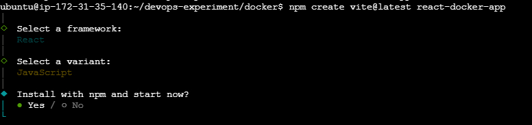
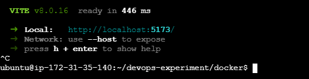
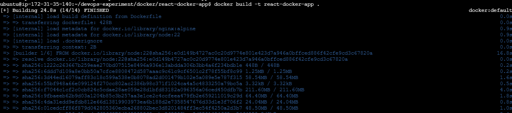
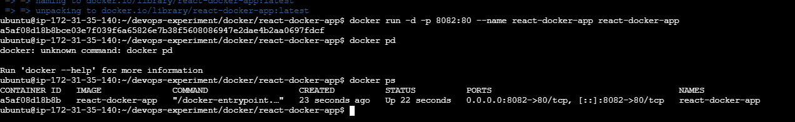
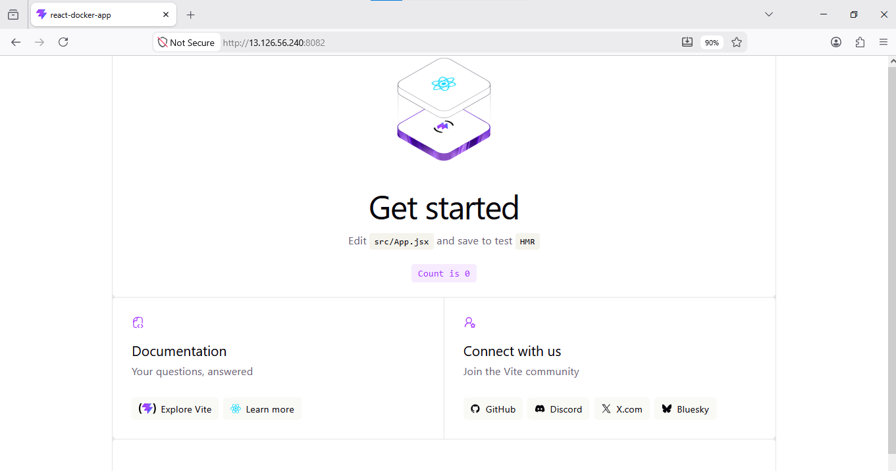
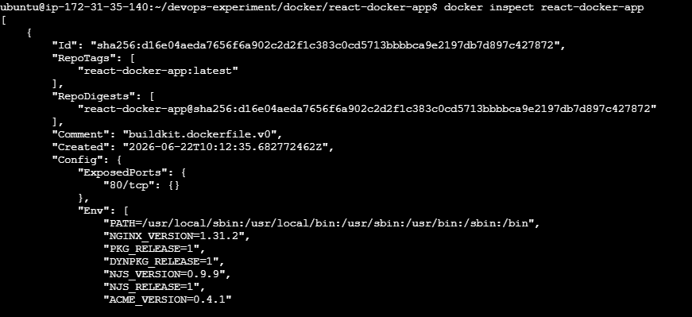
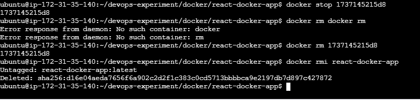

# Docker Multi-Stage Build for a React Application

## Overview

This task demonstrates how to use **Docker Multi-Stage Builds** to efficiently containerize a React application — building with Node.js and serving with Nginx, resulting in a minimal production image.

---

## Stack

| Technology | Purpose |
|---|---|
| Ubuntu Server | Host environment |
| Docker | Containerization |
| React.js (Vite) | Frontend framework |
| Nginx | Production web server |
| Multi-Stage Docker Build | Optimized image creation |

---

## Objective

Learn how to use Multi-Stage Builds to:

- ✅ Build a React application in one stage (Node.js)
- ✅ Serve the built static files using Nginx in another stage
- ✅ Reduce final image size by excluding Node.js from production
- ✅ Follow Docker best practices

---

## Scenario

Your development team has created a React frontend application. The application requires Node.js **only during the build process**. In production, Node.js is unnecessary because React generates static files.

The goal is to use a multi-stage Docker build so that the **final image contains only Nginx and the built application files** — keeping it lean and secure.

---

## Project Structure

```
react-docker-app/
├── public/
├── src/
│   ├── App.jsx
│   └── main.jsx
├── index.html
├── package.json
├── vite.config.js
├── Dockerfile
└── .dockerignore
```

---

## Getting Started

### 1. Navigate to the Working Directory

```bash
cd /home/ubuntu/devops-experiment/docker
```

### 2. Create the React App with Vite

```bash
npm create vite@latest react-docker-app
cd react-docker-app
```

When prompted, select:
- **Framework:** React
- **Variant:** JavaScript (or TypeScript)

<br/>

Exit from vite by CTRL+C, once the installation complete as below:
<br/>

---

## Configuration Files

### `.dockerignore`

Create a `.dockerignore` file to exclude unnecessary files from the Docker build context, reducing build time and image size:

```
node_modules
npm-debug.log
dist
.git
.gitignore
*.md
.env
.env.*
```

### `Dockerfile` (Multi-Stage Build)

```dockerfile
# ──────────────────────────────────────────
# Stage 1: Build Stage
# ──────────────────────────────────────────
FROM node:22 AS builder

# Set working directory
WORKDIR /app

# Copy dependency files first (layer caching)
COPY package*.json ./

# Install dependencies
RUN npm install

# Copy the rest of the application source
COPY . .

# Build the React app for production
RUN npm run build

# ──────────────────────────────────────────
# Stage 2: Production Stage
# ──────────────────────────────────────────
FROM nginx:alpine

# Copy built static files from the builder stage
COPY --from=builder /app/dist /usr/share/nginx/html

# Expose port 80
EXPOSE 80

# Start Nginx
CMD ["nginx", "-g", "daemon off;"]
```

---

## Build & Run

### Build the Docker Image

```bash
docker build -t react-docker-app .
```
<br/>

### Run the Container

```bash
docker run -d -p 8080:80 --name react-app react-docker-app
```
Please note that here I have taken port 8082

<br/>

### Access the Application

Open your browser and navigate to:

```
http://<public-ip-of-ubuntu-server>:8080
```
<br/>

---

## 🔍 Verify Image Size Reduction

Compare the size difference between stages:

```bash
# List all images
docker images

# Inspect the final image
docker inspect react-docker-app
```
<br/>

> 💡 The final image is significantly smaller than a Node.js-based image because it only includes Nginx and the static build files — **Node.js is not included in production**.

---

## 🧹 Cleanup

```bash
# Stop the container
docker stop react-app

# Remove the container
docker rm react-app

# Remove the image
docker rmi react-docker-app
```
<br/>

---

## 📌 Key Concepts

| Concept | Description |
|---|---|
| **Multi-Stage Build** | Uses multiple `FROM` statements; only the final stage is shipped |
| **Build Stage** | Uses `node:22` to install dependencies and compile the React app |
| **Production Stage** | Uses `nginx:alpine` — a minimal image with only what's needed |
| **`COPY --from=builder`** | Transfers only the compiled `/dist` folder to the final image |
| **`.dockerignore`** | Prevents unnecessary files from being sent to the Docker daemon |

---

## ✅ Best Practices Followed

- [x] Multi-stage build to separate build and runtime environments
- [x] `.dockerignore` to reduce build context size
- [x] `node:22` for reproducible builds
- [x] `nginx:alpine` for a minimal production image
- [x] Dependency files copied before source code (Docker layer caching)
- [x] No secrets or environment-specific files in the image

---

##  Author

**Sinsha C** — [GitHub](https://github.com/sinsha-c)

---